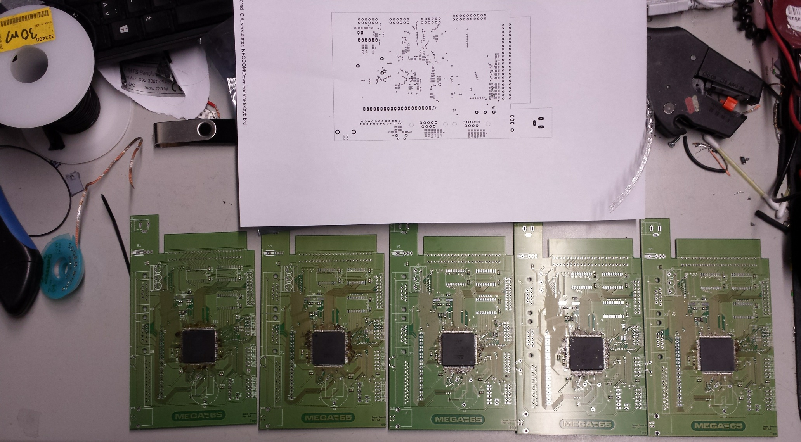

# Firmware for the DM65PIC
## MEGA65 Computer


MEGA65 is an open-source new and open C65-like computer.
All hardware designs and all software are open-source (LGPL).
Please visit www.mega65.org to learn more about it.

## DM65PIC Peripheral Interface Controller
The DM65PIC is the peripheral interface controller for the MEGA65 computer.
It is based on the [STM32F4 microcontroller](http://www.st.com/stm32f4).

The purpose of the DM65PIC is to provide an interface to an original
Commodore 65 prototype keyboard and to provide joystick ports. Future versions
will also be able to work with standard C64 keyboards and with the MEGA65
custom keyboard and these keyboards will also be able to be used as standard
USB HID devices e.g. while using emulators. Additionally we will implement the
Commodore 65 user port in future versions.

Here is a foto of some prototype version of our custom PCB:



This GitHub repository is containing the firmware of the DM65PIC.

You can see a combination of a MEGA65 FPGA prototype (based on a Nexys 4 DDR
board), a DMPIC65 prototype and a very first work-in-progress version of the
firmware in conjuncton with a real Commodore 65 prototype keyboard in action
on YouTube: [https://youtu.be/5PpsEw80j3M](https://youtu.be/5PpsEw80j3M).

### Folder structure
```
00-STM32F4xx_STANDARD_PERIPHERAL_DRIVERS  STM32 CMSIS and standard peripheral drivers
00-STM32F429_LIBRARIES                    Tilen Majerle's STM32F4 library
01-DM65PIC                                Firmware for the DM65PIC
bin                                       Firmware binary and how-to-flash documentation
eagle                                     Hardware design for the PCB
```

The actual firmware is located within the file `main.c` in the folder
`01-DM65PIC/01-DM65PIC/User`.

### How to flash
In the folder `bin` you always find the latest binary version of the firmware
as a `.hex` file. There is also the file `bin/README.md` that explains you
how to flash the DM65PIC firmware using a Windows, OSX or Linux machine.

### How to build
We used the free version of [Keil uVision5](http://www.keil.com/uvision/).
The free version is code-size constrained (32KB), but as our compiled firmware
(including all the libs) is smaller than 32KB, the free version works fine.

After having installed the Keil IDE, just double click or open the file
`project.uvprojx` in the `01-DM65PIC` folder. As all paths are relative, you
should be able to build without further modifications.

### How the interface works
The DM65PIC is doing a matrix scan on the original Commodore 65 keyboard by
letting current flow through the columns and then find out if a key is pressed
by checking, if the current from the column arrives at a certain row. That
means, we configure all "row pins" of the STM32 microcontroller as outputs
(no pullup/pulldown resistor) and all "column pins" as inputs (pulldown
resistor).

The following diagram is the basis for the matrix scan. It is taken from
Commodore's original document
[c65manual.txt](http://www.zimmers.net/cbmpics/cbm/c65/c65manual.txt),
chapter 2.1.2.

```

            +-----+-----+-----+-----+-----+-----+-----+-----+-----+            +-----+
            | C0  | C1  | C2  | C3  | C4  | C5  | C6  | C7  | C8  |            | GND |
            |PIN20|PIN19|PIN18|PIN17|PIN16|PIN15|PIN14|PIN13|PIN-4|            |PIN-1|
            +--+--+--+--+--+--+--+--+--+--+--+--+--+--+--+--+--+--+            +--+--+
               |     |     |     |     |     |     |     |     |                  |
               |     |     |     |     |     |     |     |     |                  |
               V     V     V     V     V     V     V     V     V                  |
+-----+     +-----+-----+-----+-----+-----+-----+-----+-----+-----+               |
| R0  |<----+ INS |  #  |  %  |  '  |  )  |  +  | œ   |  !  | NO  |               |
|PIN12|     | DEL |  3  |  5  |  7  |  9  |     |     |  1  | SCRL|               |
+-----+     +-----+-----+-----+-----+-----+-----+-----+-----+-----+               |
| R1  |<----+ RET |  W  |  R  |  Y  |  I  |  P  |  *  | <-- | TAB |               |
|PIN11|     |     |     |     |     |     |     |     |     |     |               |
+-----+     +-----+-----+-----+-----+-----+-----+-----+-----+-----+               |
| R2  |<----+ HORZ|  A  |  D  |  G  |  J  |  L  |  ]  | CTRL| ALT |               |
|PIN10|     | CRSR|     |     |     |     |     |  ;  |     |     +----------+    |
+-----+     +-----+-----+-----+-----+-----+-----+-----+-----+-----+          |    |
| R3  |<----+ F8  |  $  |  &  |  {  |  0  |  -  | CLR |  "  | HELP|          |    |
|PIN-9|     | F7  |  4  |  6  |  8  |     |     | HOM |  2  |     |          |    |
+-----+     +-----+-----+-----+-----+-----+-----+-----+-----+-----+          |    |
| R4  |<----+ F2  |  Z  |  C  |  B  |  M  |  >  |RIGHT|SPACE| F10 |          |    |
|PIN-8|     | F1  |     |     |     |     |  .  |SHIFT| BAR | F9  |          |    |
+-----+     +-----+-----+-----+-----+-----+-----+-----+-----+-----+          |    |
| R5  |<----+ F4  |  S  |  F  |  H  |  K  |  [  |  =  | C=  | F12 |          |    |
|PIN-7|     | F3  |     |     |     |     |  :  |     |     | F11 |          |    |
+-----+     +-----+-----+-----+-----+-----+-----+-----+-----+-----+          |    |
| R6  |<----+ F6  |  E  |  T  |  U  |  O  |  @  |  ã  |  Q  | F14 |          |    |
|PIN-6|     | F5  |     |     |     |     |     |  ^  |     | F13 |          |    |
+-----+     +-----+-----+-----+-----+-----+-----+-----+-----+-----+          |    |
| R7  |<----+ VERT|LEFT |  X  |  V  |  N  |  <  |  ?  | RUN | ESC +------+   |    |
|PIN-5|     | CRSR|SHIFT|     |     |     |  ,  |  /  | STOP|     +--+   |   |    |
+-----+     +--+--+--+--+-----+-----+-----+-----+--+--+-----+-----+  |   |   |    |
               |     |                             |                 |   |   |    |
               |     |                             |                 |   |   |    |
               |  +--+--+     /      (LOCKING)     |                 |   |   |    |
               |  |SHIFT+----+  +------------------------------------+   |   |    |
               |  | LOCK|                          |                     |   |    |
               |  +-----+                          |                     |   |    |
               |                             +-----+-----+               |   |    |
            +--+--+                          |           |               |   |    |
            |CRSR +------------+-------------+           +---------------+   |    |
            | UP  |        K1 PIN-21         |           |                   |    |
            +--+--+                          |   4066    |                   |    |
               |                             |  DECODER  |                   |    |
            +--+--+                          |           |                   |    |
            |CRSR +------------+-------------+           +-------------------+    |
            |LEFT |        K2 PIN-22         |           |                        |
            +-----+                          +-----------+                        |
                                                                                  |
+-----+           +-----+     /                                                   |
| NMI | <---------+RESTR+----+  +-------------------------------------------------+
|PIN-3|           |     |                                                         |
+-----+           +-----+                                                         |
                                                                                  |
                                                                                  |
+-----+           +-----+     /      (LOCKING)                                    |
| R8  | <---------+CAPS +----+  +-------------------------------------------------+
|PIN-2|           |LOCK |
+-----+           +-----+

Keyboard Notes:

1. The  64 keys under C0 through C7 occupy the same matrix position as
   in the C/64,  as does the RESTORE key.  Including SHIFT-LOCK, there
   are 66 such keys.

2. The  extended  keyboard consists of the 8 keys under the C8 output.
   Counting the CAPS-LOCK key, there are 9 new keys. The C/64 does not
   scan these keys.

3. The new CURSOR LEFT and CURSOR UP keys simulate a CURSOR plus RIGHT
   SHIFT key combination.

4. The  keyboard mechanism will be mechanically similar to that of the
   C128.
```

While scanning the matrix, the DM65PIC firmware stores the status of each
single key in an array, that is then transmitted to the MEGA65 FPGA using
the Nexys 4 DDR's General Purpose IO (GPIO) port "JB".

The protocol between the DM65PIC and the FPGA works like this: Cyclically,
128-bit are transmitted as 32 (4-bit) nibbles. Each nibble represents 4 bit
within the above-mentioned matrix. Nibble #0 represents the keys INS/DEL,
RET, HORZ/CRSR, F8/F7. Nibble #1 represents F2/F1, F4/F3, F6/F5, VERT/CRSR.
And so on. Here is the full description of the data sequence:

```
nbls #0 - #17:   keyboard bits corresponding to the 9 columns of keys (see above)
nbl #18:         joystick 1: bit0=up, bit1=down, bit2=left, bit3=right
nbl #19:         bit0=joy1 fire, bit2=capslock key status, bit3=restore key status
nbl #20:         joystick 2: bit0=up, bit1=down, bit2=left, bit3=right
nbl #21:         bit0=joy2 fire, bit3=reset momentary-action switch status
nbl #22 onwards: expansion port connector
```


The nibbles are transmitted by setting below-mentioned "bit0" .. "bit3" pins
of the "JB" port and then clocking pin "JB1". For synchronizing the
transmission, the "start of sequence" pin "JB2" is used as soon as a new
128-bit package starts.

The FPGA is also able to communicate back to the DM65PIC, i.e. for transmitting
the LED status; but this is not supported, yet in the current version of the
firmware.

Here is the pin layout for the FPGA's "JB" port:

```
JB1  = PG8:  clock; data must be valid before rising edge
JB2  = PG9:  start of sequence, set to 1 on first nibble of a new 128bit sequence
JB3  = PG10: bit0 of output data nibble
JB4  = PG11: bit1 of output data nibble
JB7  = PG12: bit2 of output data nibble
JB8  = PG13: bit3 of output data nibble
JB9  = PG14: bit 0 of input bit pair
JB10 = PG15: bit 1 of input bit pair
```

### Credits
* [Paul Gardner-Stephen](http://c65gs.blogspot.de): MEGA65 main developer
* [Deft](http://www.m-e-g-a.org/de/mega/profile): chief MEGA65 officer
* doubleflash: DM65PIC hardware design
* [sy2002](http://www.sy2002.de): DM65PIC firmware in this GitHub repository

Special thanks go to [Tilen Majerle](https://github.com/MaJerle) for
supporting sy2002 in learning how to work with the STM32 toolchain and of
course for creating the awesome [STM32F4 library](http://stm32f4-discovery.com)
that we heavily used for creating the DM65PIC firmware.
