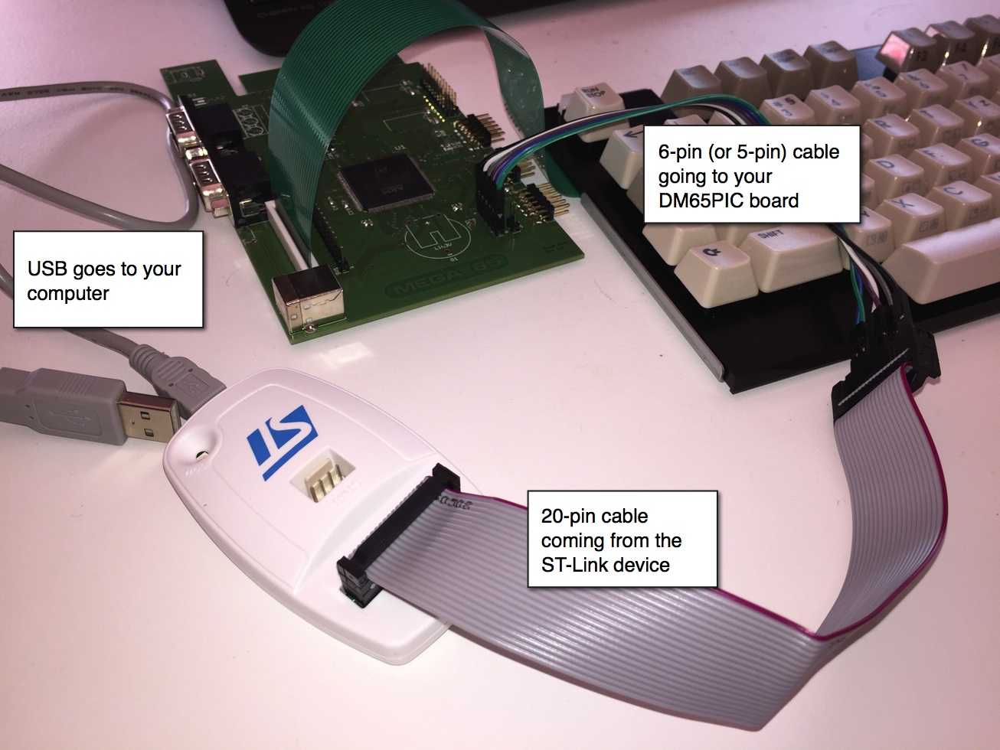
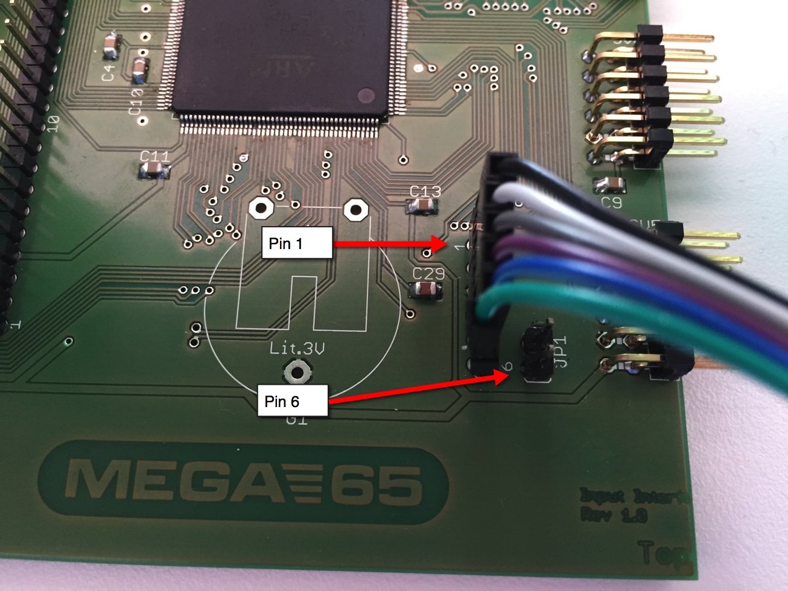
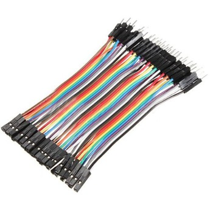
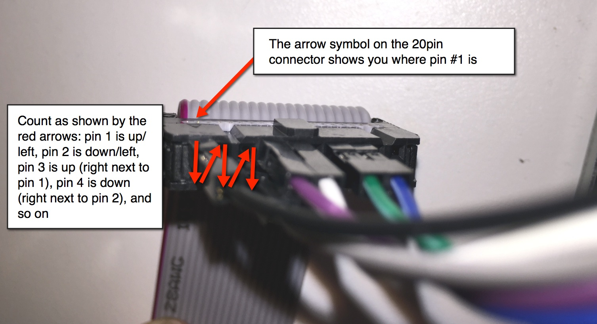

How to flash the firmware on the DM65PIC
========================================

Get the latest firmware and instructions here:

https://github.com/sy2002/DM65PIC/tree/master/bin

What you need
-------------

1. You need to have a ST-LINK/V2 (or compatible) device connected to any
   USB port of your PC, Mac or Linux device.

2. You need a cable that maps the 20-pin connector of the ST-LINK device
   to the 6-pin connector on the DM65PIC board.

3. You need either the original STLINK tool, if you're using Windows or
   the Open Source tool OpenOCD, if you're using OSX or Linux.

Cables and Devices
------------------

There a lot of ST-LINK/V2 compatible devices out there. We tried the original
from ST as well as cheap Chines clones. It works, no matter what (compatible)
device you are using, as long as you have the right pin-mapping on the cable.


   
As you can see on the image above, the programmer is connected via USB to your
host machine. Instructions for Windows, Mac and Linux of about the software
side of things are below.

Let's focus on the cable first: Most ST-LINK devices come with some kind of
a 20-pin connector. We don't need all of these 20 pins to program the DM65PIC,
but just 5 of them are really essential. Optionally, we can connect pin 6,
which then can be used to display debug- and trace-output on a console.

The following picture is showing you, where to find the 6-pin connector on the
DM65PIC board. You are counting the 6 pins from top to bottom:



The meaning of the 6 pins is the following:

```
1 +3.3 volt  (The programmer uses this to detect the device)
2 SWCLK      (ST Wire Bus Clock)
3 GND
4 SWDIO      (ST Input/Output)
5 NRST       (Reset Wire)
6 SWDTO      (Trace Output, this is optional and not needed for flashing)
```

To build the mapping from the 20-pin ST-LINK cable to the 6-pin DM65PIC
connector, you need standard jumper wires male-female or female-female
(depending on how your ST-LINK cable or adapter looks). Some of the ST-LINK
devices are already coming with a set of jumper wires, but you can also
easily get them on eBay or Amazon: Just enter something like
`jumper wire male female` or `breadboard cable male female` into the
search bar. It looks like this:



"Mapping" as mentioned above now means: Make sure, that the 3.3 volt pin of
your programming device maps to the 3.3 volt pin of the DM65PIC, which is
pin 1. Make sure, that the SWCLK pin of the programming device maps to the
SWCLK pin of the DM65PIc, which is pin 2. And so on. You can find out the
mapping by having a look in the reference manual of your device.

If you are using an original device from ST or a device with compatible
connectors, then the mapping is as follows:

```
   DM65PIC       ST-LINK
       1   --->     1
       2   --->     9
       3   --->     6
       4   --->     7
       5   --->    15
      *6   --->   *13

(*) optional connection, only used for tracing/debugging (ARM Semihosting)
```

Make sure, that you are counting the pins on the ST-LINK connector in the
right way as shown in the following image:



Now you are ready to program / flash your DM65PIC board as described in the
following sections.

Windows
-------

1. Go to www.st.com

2. Enter   STSW-LINK004   in the search box on the top right

3. Click on the first search result

4. Download, install and start the software

5. Choose "Connect" from the "Target" menu. If this is not working,
   then your STLINK-to-DM65PIC cable is wrong and/or DM65PIC is not powered.

6. The "Connect" takes about 5 seconds

7. Choose "Program & Verify" from the "Target" menu

8. Choose the `dm65pic-firmware-rev1.hex` file

9. Select "Verify after programming" and make sure that "Reset after
   programming" is checked.

10. Press "Start".

The firmware is now persistently flashed and will start as soon
as the DM65PIC is powered on.


Mac OSX or Linux
----------------

1. Get the tool OpenOCD from here http://openocd.org

2. For OSX users: If you use homebrew (recommended! http://brew.sh) then
   installing OpenOCD is very easy. Just open a terminal and enter:

   `brew install openocd`

3. Copy the file `dm65pic.cfg` from this repository to some folder on your
   computer, open a terminal and go to that folder where you copied
   `dm65pic.cfg`.

4. Enter:

   `openocd --file dm65pic.cfg`

   If any error occurs, then your cable STLINK-to-DM65PIC is wrong and/or
   DM65PIC is not powered.

5. Executing (4) creates a local telnet server on port 4444, so open another
   terminal window and enter

   `telnet localhost 4444`

6. Enter

   `halt`

7. Enter

   `flash write_image erase <fullpath-to-the-hex-file>`

   In the <fullpath-to-the-hex-file> no things like "~" are allowed.
   Use really the full path starting from the root folder.

8. If an error occurs,  enter:

    ```
    halt
    reset
    halt
    ```

9. And then try (7) again.

10. If it says something like "wrote xyz bytes from file abc" then enter

   `reset`

   (reset starts the firmware)

11. Enter:

    `exit`

12. You can now close all terminal windows, including the OpenOCD server


The firmware is now persistently flashed and will start as soon
as the DM65PIC is powered on.

